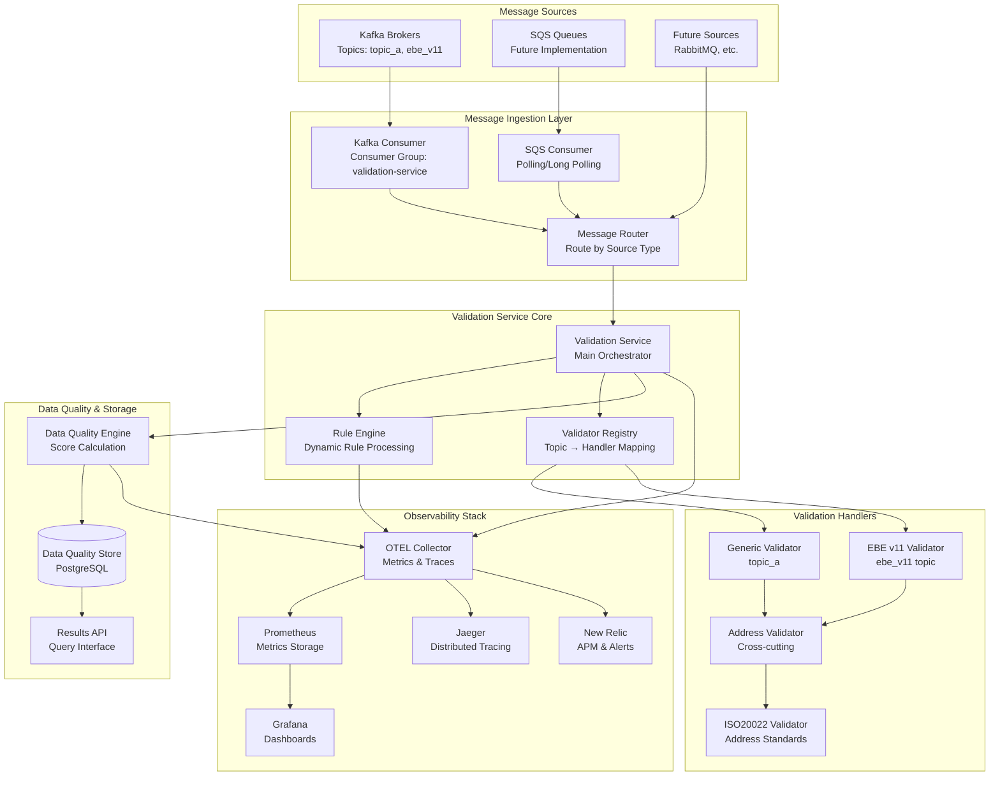
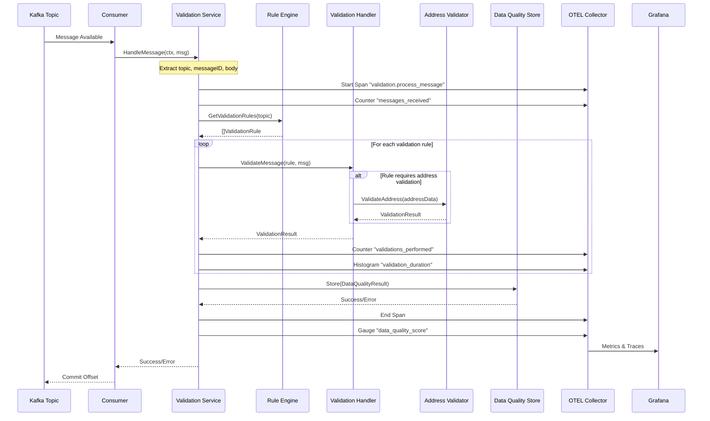
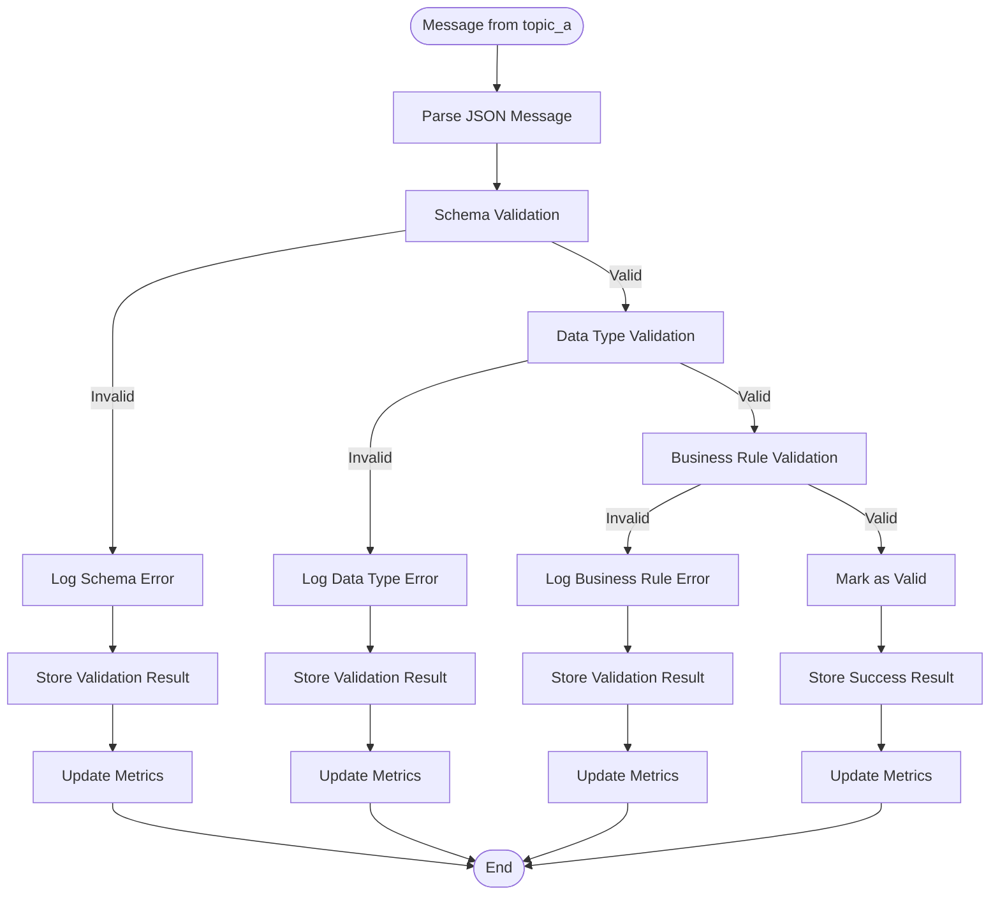
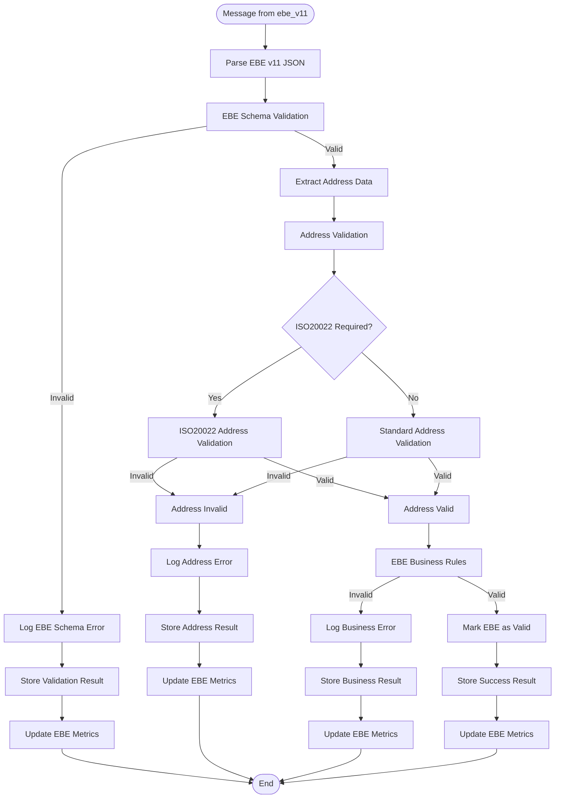
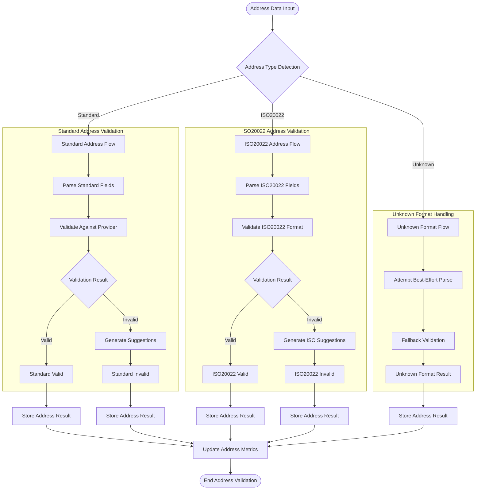
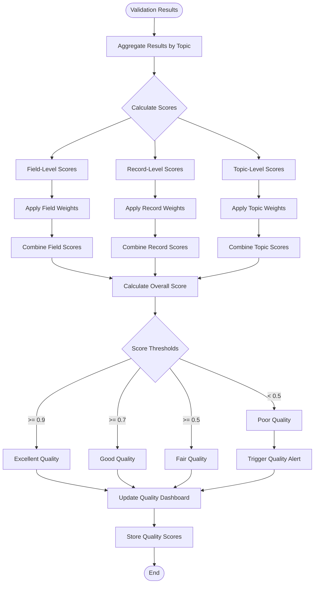
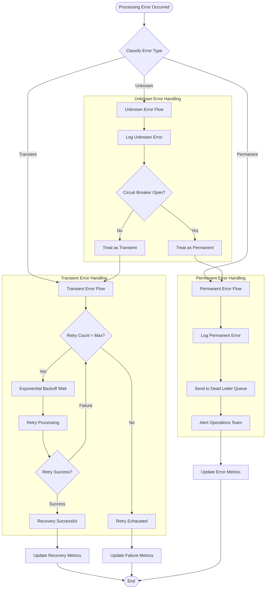
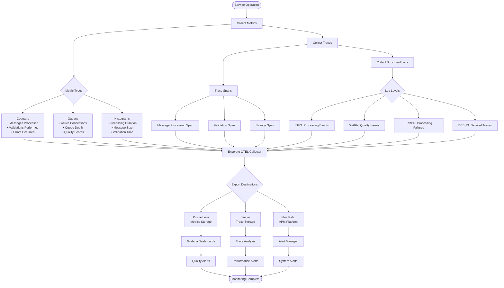
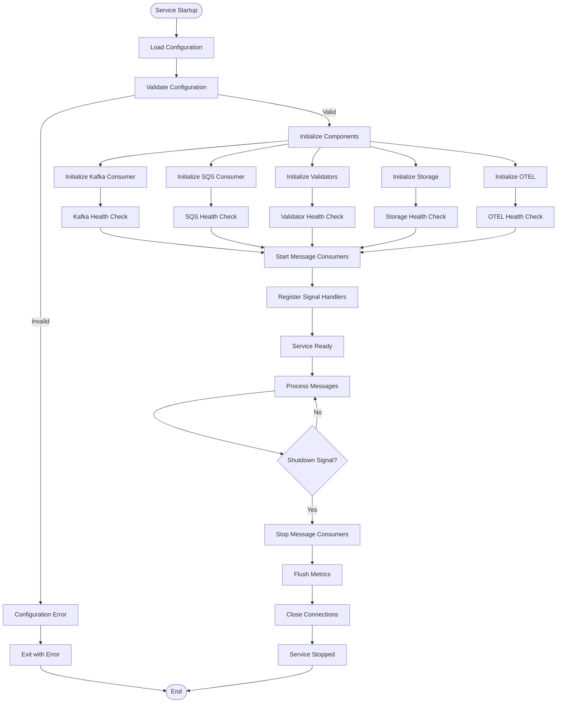

# Validation Service Flow Diagrams

## Overall System Architecture

## Message Processing Flow

## Topic-Specific Validation Flows

### Topic A (Generic) Validation Flow

### EBE v11 Validation Flow

## Address Validation Flow

## Data Quality Scoring Flow

## Error Handling and Recovery Flow

## Observability and Monitoring Flow

## Configuration and Deployment Flow

These Mermaid diagrams provide comprehensive visualization of:

1. **Overall System Architecture** - High-level component relationships
2. **Message Processing Flow** - Detailed sequence of message handling
3. **Topic-Specific Flows** - Specialized validation for different message types
4. **Address Validation Flow** - Comprehensive address validation logic
5. **Data Quality Scoring** - Quality metric calculation and classification
6. **Error Handling** - Robust error recovery and circuit breaker patterns
7. **Observability Flow** - Complete monitoring and alerting pipeline
8. **Configuration/Deployment** - Service lifecycle and health management

Each diagram focuses on a specific aspect of the validation service, making it easy to understand the flow and implement the corresponding code components.